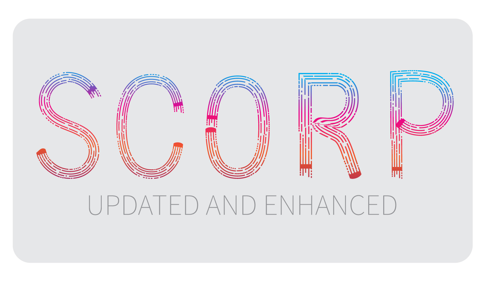

### Hi there 👋

<h1>
  Hello I'm Nischay Sharma
</h1>

<h3>About</h3>

Hi, I am a full stack web developer with experience over 1 year in building large and dynamic web applications.

I can also make dynamic frontends from scratch with HTML,CSS and JAVASCRIPT and have a command over popular frontend frameworks like ReactJs and VueJs.

I had worked with different databases like mongoDB and postgresSQL and integration of databases in various types of web application.

I have worked with different backend servers like Flask,Django and ExpressJs, also worked with creating APIs and using them with frontend along with database integration.

I have worked with AWS S3 for uploading data and adding and deleting domains,subdomains and creating S3 bucket to store data. 

